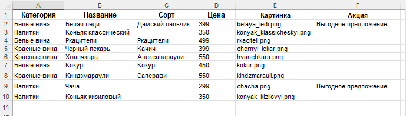

# Новое русское вино

Сайт магазина авторского вина "Новое русское вино".

## Запуск

- Скачайте код
- Установите зависимости командой
  ```
  pip install -r requirements.txt
  ```
- Создайте в директории проекта файл базы данных `wine.xlsx` со следующей структурой:
  
- Изображения хранящиеся в поле `Картинка` файла `wine.xlsx` сохраните в директории `/images`
- Запустите сайт командой
  ```
  python3 main.py
  ```
- Перейдите на сайт по адресу [http://127.0.0.1:8000](http://127.0.0.1:8000).

## Настройки

Если необходимо использовать альтернативный шаблон или файл БД - создайте в корне поректа файл `settings.py` и сохраните в нём путь к шаблону и/или файлу БД в следующем формате:

```
WINE_DATA_PATH = '<путь_к_бд>/<файл_бд>.xlsx'
TEMPLATE_PATH = '<путь_к_шфблону>/<шаблон>.html'
```

## Цели проекта

Код написан в учебных целях — это урок в курсе по Python и веб-разработке на сайте [Devman](https://dvmn.org).
